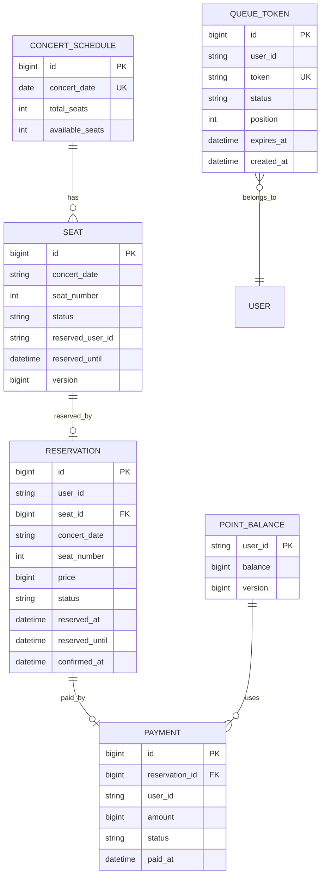

# 콘서트 예약 서비스 - 아키텍처 문서

## 📋 목차
1. [개요](#1-개요)
2. [전체 아키텍처](#2-전체-아키텍처)
3. [도메인별 아키텍처](#3-도메인별-아키텍처)
4. [계층 구조](#4-계층-구조)
5. [동시성 제어](#5-동시성-제어)
6. [예외 처리](#6-예외-처리)
7. [스케줄링](#7-스케줄링)

---

## 1. 개요

### 프로젝트 목표
콘서트 좌석 예약 시스템으로, 대기열 기반 트래픽 제어와 동시성 처리를 구현합니다.

### 기술 스택
| 분류 | 기술 |
|------|------|
| Language | Java 21 |
| Framework | Spring Boot 3.4.1 |
| ORM | Spring Data JPA + Hibernate |
| Database | MySQL 8.0 |
| Build Tool | Gradle (Kotlin DSL) |
| Testing | JUnit 5, Mockito, Testcontainers |
| Documentation | OpenAPI 3.0 (Swagger) |

### 아키텍처 적용 원칙
- **예약/결제 도메인**: 클린 아키텍처 (UseCase 패턴)
- **콘서트/포인트/대기열 도메인**: 레이어드 아키텍처 (Service 패턴)

---

## 2. 전체 아키텍처

```
┌─────────────────────────────────────────────────────────────────────┐
│                        Interfaces Layer                              │
│  ┌─────────────┐ ┌─────────────┐ ┌─────────────┐ ┌─────────────┐    │
│  │ QueueController│ │ConcertController│ │ReservationController│ │PaymentController│
│  └──────┬──────┘ └──────┬──────┘ └──────┬──────┘ └──────┬──────┘    │
└─────────┼───────────────┼───────────────┼───────────────┼───────────┘
          │               │               │               │
┌─────────┼───────────────┼───────────────┼───────────────┼───────────┐
│         ▼               ▼               ▼               ▼           │
│  ┌─────────────┐ ┌─────────────┐ ┌─────────────┐ ┌─────────────┐    │
│  │ QueueService │ │ConcertService│ │ReserveSeatUseCase│ │ProcessPaymentUseCase│
│  │  (Layered)   │ │  (Layered)   │ │   (Clean)    │ │    (Clean)    │    │
│  └──────┬──────┘ └──────┬──────┘ └──────┬──────┘ └──────┬──────┘    │
│                      Application Layer                               │
└─────────┼───────────────┼───────────────┼───────────────┼───────────┘
          │               │               │               │
┌─────────┼───────────────┼───────────────┼───────────────┼───────────┐
│         ▼               ▼               ▼               ▼           │
│  ┌─────────────┐ ┌─────────────┐ ┌─────────────┐ ┌─────────────┐    │
│  │ QueueToken  │ │    Seat     │ │ Reservation │ │   Payment   │    │
│  │PointBalance │ │ConcertSchedule│              │             │    │
│  └──────┬──────┘ └──────┬──────┘ └──────┬──────┘ └──────┬──────┘    │
│                       Domain Layer                                   │
└─────────┼───────────────┼───────────────┼───────────────┼───────────┘
          │               │               │               │
          ▼               ▼               ▼               ▼
┌─────────────────────────────────────────────────────────────────────┐
│                       Infrastructure Layer                           │
│  ┌───────────────────────────────────────────────────────────────┐  │
│  │                    Spring Data JPA Repositories                │  │
│  └───────────────────────────────────────────────────────────────┘  │
│  ┌───────────────────────────────────────────────────────────────┐  │
│  │                         MySQL 8.0                              │  │
│  └───────────────────────────────────────────────────────────────┘  │
└─────────────────────────────────────────────────────────────────────┘
```

---

## 3. 도메인별 아키텍처

### 3.1 레이어드 아키텍처 (대기열, 콘서트, 포인트)

```
┌─────────────────────────────────┐
│     Controller (Interfaces)     │  ← HTTP 요청 처리
├─────────────────────────────────┤
│        Service (Application)    │  ← 비즈니스 로직
├─────────────────────────────────┤
│       Repository (Domain)       │  ← 데이터 접근 인터페이스
├─────────────────────────────────┤
│        Entity (Domain)          │  ← 도메인 엔티티
└─────────────────────────────────┘
```

**적용 도메인:**
- `QueueService` - 대기열 토큰 발급/조회
- `ConcertService` - 공연 날짜/좌석 조회
- `PointService` - 포인트 충전/차감

### 3.2 클린 아키텍처 (예약, 결제)

```
┌─────────────────────────────────┐
│     Controller (Interfaces)     │  ← HTTP 요청 처리
├─────────────────────────────────┤
│      UseCase (Application)      │  ← 유스케이스 인터페이스
│      UseCaseImpl                │  ← 유스케이스 구현체
├─────────────────────────────────┤
│       Repository (Domain)       │  ← 데이터 접근 인터페이스
├─────────────────────────────────┤
│        Entity (Domain)          │  ← 도메인 엔티티 + 비즈니스 로직
└─────────────────────────────────┘
```

**적용 도메인:**
- `ReserveSeatUseCase` - 좌석 임시 예약
- `ProcessPaymentUseCase` - 결제 처리

---

## 4. 계층 구조

### 패키지 구조

```
src/main/java/kr/hhplus/be/server/
├── ServerApplication.java
│
├── application/                    # 애플리케이션 계층
│   ├── concert/
│   │   └── ConcertService.java         # 레이어드
│   ├── point/
│   │   └── PointService.java           # 레이어드
│   ├── queue/
│   │   └── QueueService.java           # 레이어드
│   ├── reservation/
│   │   └── usecase/
│   │       ├── ReserveSeatUseCase.java       # 인터페이스
│   │       └── ReserveSeatUseCaseImpl.java   # 구현체
│   ├── payment/
│   │   └── usecase/
│   │       ├── ProcessPaymentUseCase.java    # 인터페이스
│   │       └── ProcessPaymentUseCaseImpl.java
│   └── scheduler/
│       └── ExpirationScheduler.java    # 스케줄러
│
├── domain/                         # 도메인 계층
│   ├── concert/
│   │   ├── Seat.java                   # 엔티티
│   │   ├── SeatStatus.java             # Enum
│   │   ├── ConcertSchedule.java
│   │   ├── SeatRepository.java         # 리포지토리 인터페이스
│   │   └── ConcertScheduleRepository.java
│   ├── reservation/
│   │   ├── Reservation.java
│   │   ├── ReservationStatus.java
│   │   └── ReservationRepository.java
│   ├── payment/
│   │   ├── Payment.java
│   │   ├── PaymentStatus.java
│   │   └── PaymentRepository.java
│   ├── point/
│   │   ├── PointBalance.java
│   │   └── PointBalanceRepository.java
│   └── queue/
│       ├── QueueToken.java
│       ├── TokenStatus.java
│       └── QueueTokenRepository.java
│
├── interfaces/                     # 인터페이스 계층
│   └── api/
│       ├── concert/
│       │   ├── ConcertController.java
│       │   └── dto/
│       ├── reservation/
│       │   ├── ReservationController.java
│       │   └── dto/
│       ├── payment/
│       │   ├── PaymentController.java
│       │   └── dto/
│       ├── point/
│       │   ├── PointController.java
│       │   └── dto/
│       └── queue/
│           ├── QueueController.java
│           └── dto/
│
├── common/                         # 공통 모듈
│   └── exception/
│       ├── BusinessException.java
│       ├── GlobalExceptionHandler.java
│       └── ProblemDetail.java
│
└── config/                         # 설정
    ├── DataInitializer.java
    ├── jpa/
    │   └── JpaConfig.java
    └── swagger/
        └── SwaggerConfig.java
```

### 의존성 방향

```
Interfaces → Application → Domain
                ↓
         Infrastructure (Spring Data JPA)
```

- **Domain**: 의존성 없음 (POJO + JPA 어노테이션만)
- **Application**: Domain에만 의존
- **Interfaces**: Application에만 의존
- **Infrastructure**: Spring Data JPA가 Domain Repository 인터페이스 구현

---

## 5. 동시성 제어

### 5.1 낙관적 락 (Optimistic Lock)

**적용 엔티티:**
- `Seat` - 좌석 예약 시 버전 충돌 감지
- `PointBalance` - 포인트 충전 시 버전 충돌 감지

```java
@Entity
public class Seat {
    @Version
    private Long version;  // 낙관적 락
}
```

**사용 시나리오:**
- 동시에 같은 좌석 예약 시도 → 먼저 커밋한 트랜잭션만 성공
- `OptimisticLockingFailureException` 발생 시 재시도 요청

### 5.2 비관적 락 (Pessimistic Lock)

**적용 위치:**
- `PointBalanceRepository.findByUserIdWithLock()` - 포인트 차감 시

```java
@Lock(LockModeType.PESSIMISTIC_WRITE)
Optional<PointBalance> findByUserIdWithLock(String userId);
```

**사용 시나리오:**
- 결제 시 포인트 차감 → 동시 요청 시 순차 처리

### 5.3 동시성 제어 전략

| 상황 | 전략 | 이유 |
|------|------|------|
| 좌석 예약 | 낙관적 락 | 충돌 빈도 낮음, 성능 우선 |
| 포인트 충전 | 낙관적 락 | 충돌 빈도 낮음 |
| 포인트 차감 | 비관적 락 | 정합성 중요, 잔액 부족 방지 |

---

## 6. 예외 처리

### 6.1 예외 계층

```
RuntimeException
└── BusinessException (비즈니스 예외)
    ├── message: 사용자 메시지
    ├── errorCode: 에러 코드 (ex: "seat-not-found")
    └── httpStatus: HTTP 상태 코드
```

### 6.2 전역 예외 핸들러

```java
@RestControllerAdvice
public class GlobalExceptionHandler {
    
    @ExceptionHandler(BusinessException.class)
    public ResponseEntity<ProblemDetail> handleBusinessException(BusinessException ex) {
        // RFC 7807 형식 응답
    }
    
    @ExceptionHandler(OptimisticLockingFailureException.class)
    public ResponseEntity<ProblemDetail> handleOptimisticLockingFailure(Exception ex) {
        // 409 Conflict 응답
    }
}
```

### 6.3 에러 응답 형식 (RFC 7807)

```json
{
  "type": "https://api.concert.com/problems/seat-not-found",
  "title": "BusinessException",
  "status": 404,
  "detail": "좌석을 찾을 수 없습니다.",
  "instance": null,
  "timestamp": "2025-01-20T10:30:00"
}
```

---

## 7. 스케줄링

### ExpirationScheduler

| Task | 주기 | 설명 |
|------|------|------|
| `releaseExpiredReservations` | 1분 | 만료된 임시 예약 해제 |
| `activateWaitingTokens` | 30초 | 대기 중 토큰 활성화 (최대 100개) |
| `cleanupExpiredTokens` | 5분 | 만료된 토큰 정리 |

### 설정

```java
@SpringBootApplication
@EnableScheduling  // 스케줄링 활성화
public class ServerApplication { }
```

---

## 📊 ERD



---

## 📚 참고 문서

- [시퀀스 다이어그램](./SEQUENCE_DIAGRAM.md)
- [DDL 스크립트](./schema.sql)
- [API 명세서](./openapi.yaml)
