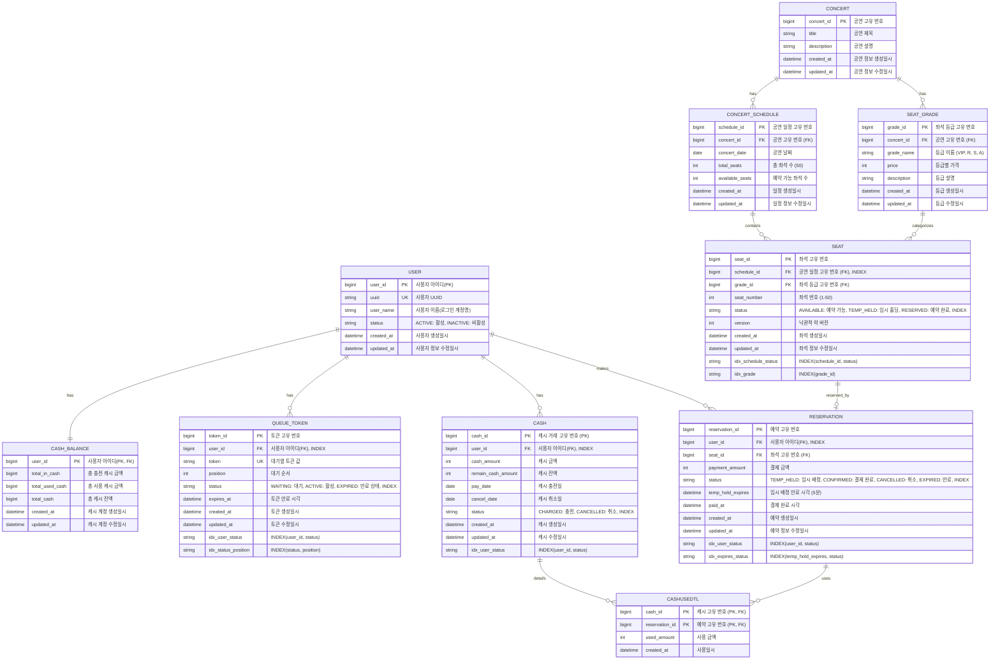

# Concert Booking Service - ER Diagram

## 주요 테이블 설명

### 1. USER (사용자)
- **역할**: 시스템 사용자 계정 관리
- **주요 필드**:
  - user_id (PK): 내부 식별자 (성능 최적화용)
  - uuid (UK): 외부 API 노출용 고유 식별자
  - user_name: 로그인 계정명
  - status: ACTIVE(활성), INACTIVE(비활성)
- **특징**: UUID를 통해 보안성 강화, 내부적으로는 bigint PK 사용

### 2. CASH_BALANCE (캐시 잔액)
- **역할**: 사용자별 캐시 잔액 집계 (성능 최적화 테이블)
- **주요 필드**:
  - user_id (PK, FK): USER 테이블과 1:1 관계
  - total_in_cash: 누적 충전 금액
  - total_used_cash: 누적 사용 금액
  - total_cash: 현재 사용 가능 잔액
  - version: 낙관적 락 버전
- **특징**: 잔액 조회 시 CASH 테이블 집계 불필요, 동시성 제어 지원

### 3. QUEUE_TOKEN (대기열 토큰)
- **역할**: 대기열 시스템의 토큰 관리
- **주요 필드**:
  - token_id (PK): 토큰 고유 번호
  - user_id (FK): 사용자 참조
  - token (UK): UUID 기반 토큰 값
  - position: 대기 순서
  - status: WAITING(대기), ACTIVE(활성), EXPIRED(만료)
  - expires_at: 토큰 만료 시각
- **인덱스**: (user_id, status), (status, position)
- **특징**: Redis와 병행 사용, DB는 영구 저장 및 감사 용도

### 4. CASH (캐시 거래 내역)
- **역할**: 캐시 충전 및 취소 이력 관리
- **주요 필드**:
  - cash_id (PK): 거래 고유 번호
  - user_id (FK): 사용자 참조
  - cash_amount: 충전 금액
  - remain_cash_amount: 거래 후 잔액 (스냅샷)
  - pay_date: 충전일
  - cancel_date: 취소일
  - status: CHARGED(충전), CANCELLED(취소)
- **인덱스**: (user_id, status)
- **특징**: 충전/취소만 기록, 사용 내역은 CASHUSEDTL에서 관리

### 5. CASHUSEDTL (캐시 사용 상세)
- **역할**: 예약별 캐시 사용 내역 추적
- **주요 필드**:
  - cash_id (PK, FK): 사용된 캐시 충전 건
  - reservation_id (PK, FK): 예약 정보
  - used_amount: 해당 충전 건에서 사용한 금액
- **특징**: 
  - 복합 PK로 CASH와 RESERVATION 다대다 관계 해소
  - FIFO 방식으로 오래된 충전 건부터 사용
  - 결제 취소 시 환불 추적 가능

### 6. CONCERT (공연)
- **역할**: 공연 기본 정보 관리
- **주요 필드**:
  - concert_id (PK): 공연 고유 번호
  - title: 공연 제목
  - description: 공연 설명
- **특징**: 공연 메타 정보만 보유, 일정은 CONCERT_SCHEDULE에서 관리

### 7. SEAT_GRADE (좌석 등급)
- **역할**: 공연별 좌석 등급 및 가격 체계 관리
- **주요 필드**:
  - grade_id (PK): 등급 고유 번호
  - concert_id (FK): 공연 참조
  - grade_name: 등급 이름 (VIP, R석, S석, A석 등)
  - price: 등급별 가격
  - description: 등급 설명
- **인덱스**: (concert_id)
- **특징**: 
  - 공연마다 다른 등급 체계 적용 가능
  - 가격 변경 시 해당 등급만 수정하면 모든 좌석에 반영
  - 데이터 중복 제거 및 관리 용이

### 8. CONCERT_SCHEDULE (공연 일정)
- **역할**: 공연별 일정 및 좌석 가용성 관리
- **주요 필드**:
  - schedule_id (PK): 일정 고유 번호
  - concert_id (FK): 공연 참조
  - concert_date: 공연 날짜
  - total_seats: 총 좌석 수 (50석)
  - available_seats: 예약 가능한 좌석 수
- **특징**: 
  - 같은 공연의 여러 일정 관리
  - available_seats로 빠른 가용성 확인
  - 날짜별로 독립적인 좌석 관리

### 9. SEAT (좌석)
- **역할**: 공연 일정별 물리적 좌석 정보 관리
- **주요 필드**:
  - seat_id (PK): 좌석 고유 번호
  - schedule_id (FK): 공연 일정 참조
  - grade_id (FK): 좌석 등급 참조
  - seat_number: 좌석 번호 (1-50)
  - status: AVAILABLE(예약가능), TEMP_HELD(임시홀딩), RESERVED(예약완료)
  - version: 낙관적 락 버전
- **인덱스**: (schedule_id, status), (grade_id)
- **특징**: 
  - 동시성 제어를 위한 version 필드
  - 등급별 가격 참조로 데이터 중복 제거
  - 상태 기반 예약 가능 여부 판단

### 10. RESERVATION (예약 및 결제)
- **역할**: 좌석 예약부터 결제 완료까지 전체 생명주기 관리
- **주요 필드**:
  - reservation_id (PK): 예약 고유 번호
  - user_id (FK): 사용자 참조
  - seat_id (FK): 좌석 참조
  - payment_amount: 결제 금액
  - status: TEMP_HELD(임시배정), CONFIRMED(결제완료), CANCELLED(취소), EXPIRED(만료)
  - temp_hold_expires: 임시 배정 만료 시각 (5분)
  - paid_at: 결제 완료 시각
- **인덱스**: (user_id, status), (temp_hold_expires, status)
- **특징**: 
  - 예약과 결제 정보 통합 관리 (PURCHASE 테이블 제거)
  - 상태 전이: TEMP_HELD → CONFIRMED / EXPIRED / CANCELLED
  - 만료 처리를 위한 temp_hold_expires 인덱스
  - 단일 테이블로 데이터 정합성 보장
## 주요 비즈니스 로직

1. **대기열 관리**
   - QUEUE_TOKEN의 position과 status로 대기 순서 관리
   - ACTIVE 상태의 토큰만 예약/구매 가능
   - Redis Sorted Set으로 실시간 대기열 순서 관리

2. **캐시 관리**
   - CASH_BALANCE에서 사용자별 실시간 잔액 조회
   - CASH 테이블에 충전/취소 내역 기록
   - 충전 시: CASH 레코드 생성 + CASH_BALANCE 업데이트
   - 사용 시: CASHUSEDTL에 사용 내역 기록 + CASH_BALANCE 차감

3. **좌석 예약**
   - SEAT 상태를 TEMP_HELD로 변경 (Redis 분산 락 + MySQL 낙관적 락)
   - RESERVATION 생성 (status=TEMP_HELD, temp_hold_expires = 현재시각 + 5분)
   - 5분 내 결제 미완료 시 SEAT 상태 AVAILABLE로 복구, RESERVATION 상태 EXPIRED로 변경

4. **결제 처리**
   - 트랜잭션 시작
   - CASH_BALANCE에서 잔액 차감 (Pessimistic Lock)
   - CASHUSEDTL에 캐시 사용 내역 생성 (reservation_id 연결)
   - RESERVATION 상태를 CONFIRMED로 변경, paid_at 기록
   - SEAT 상태를 RESERVED로 변경
   - QUEUE_TOKEN 만료 처리
   - 트랜잭션 커밋

## 동시성 제어 포인트

1. **좌석 예약**: 
   - Redis 분산 락 (SETNX) + MySQL 낙관적 락 (SEAT.version)
   - 동시에 같은 좌석 예약 시도 방지

2. **캐시 사용**: 
   - MySQL Pessimistic Lock (SELECT FOR UPDATE)
   - CASH_BALANCE 테이블의 낙관적 락 (version)
   - 동시 차감 시 잔액 불일치 방지

3. **대기열 진입**: 
   - Redis Sorted Set의 ZADD 원자성 보장
   - QUEUE_TOKEN 생성 시 position 할당

4. **캐시 충전**:
   - CASH_BALANCE 테이블의 낙관적 락 (version)
   - 동시 충전 시 정합성 보장