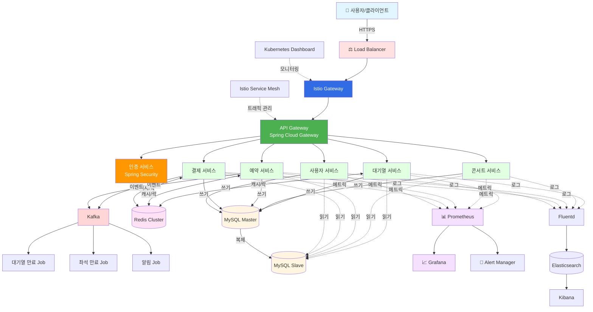
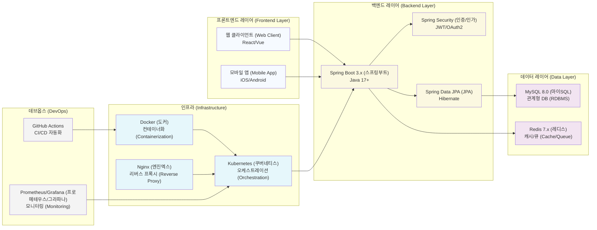

## 전체 인프라 구성도



## 상세 시스템 아키텍처

```mermaid
flowchart TB
    Users[👥 사용자/클라이언트]
    
    LB[⚖️ Load Balancer]
    IstioGW[Istio Gateway]
    
    ApiGW1[API Gateway 1<br/>Spring Cloud Gateway]
    ApiGW2[API Gateway 2<br/>Spring Cloud Gateway]
    AuthSvc1[인증 서비스 1<br/>Spring Security]
    AuthSvc2[인증 서비스 2<br/>Spring Security]
    
    QueueSvc1[대기열 서비스 Pod 1]
    QueueSvc2[대기열 서비스 Pod 2]
    ConcertSvc1[콘서트 서비스 Pod 1]
    ConcertSvc2[콘서트 서비스 Pod 2]
    ReservationSvc1[예약 서비스 Pod 1]
    ReservationSvc2[예약 서비스 Pod 2]
    PaymentSvc1[결제 서비스 Pod 1]
    PaymentSvc2[결제 서비스 Pod 2]
    UserSvc1[사용자 서비스 Pod 1]
    UserSvc2[사용자 서비스 Pod 2]
    
    QueueExpiry[대기열 만료 Job]
    SeatExpiry[좌석 만료 Job]
    NotificationJob[알림 Job]
    
    K8sDash[Kubernetes Dashboard]
    ServiceMesh[Istio Service Mesh]
    
    Redis[(Redis Cluster)]
    RedisMaster[Redis Master]
    RedisSlave1[Redis Slave 1]
    RedisSlave2[Redis Slave 2]
    RedisQueue[대기열 Sorted Set]
    RedisLock[분산 락 Keys]
    RedisSession[세션 캐시 Hash]
    
    MySQLM[(MySQL Master)]
    MySQLS1[(MySQL Slave 1)]
    MySQLS2[(MySQL Slave 2)]
    UserTable[USER 테이블]
    QueueTable[QUEUE_TOKEN 테이블]
    ConcertTable[CONCERT 테이블]
    ScheduleTable[CONCERT_SCHEDULE 테이블]
    ReservationTable[RESERVATION 테이블]
    SeatTable[SEAT 테이블]
    PaymentTable[PAYMENT 테이블]
    PointTable[POINT_TRANSACTION 테이블]
    
    Kafka[Kafka Cluster]
    KafkaTopic1[queue.expired Topic]
    KafkaTopic2[seat.expired Topic]
    KafkaTopic3[payment.completed Topic]
    
    Prometheus[📊 Prometheus]
    Grafana[📈 Grafana]
    Alerting[🔔 Alert Manager]
    
    Fluentd[Fluentd]
    Elasticsearch[(Elasticsearch)]
    Kibana[Kibana]

    Users -->|HTTPS| LB
    LB --> IstioGW
    IstioGW --> ApiGW1
    IstioGW --> ApiGW2
    
    ApiGW1 --> AuthSvc1
    ApiGW2 --> AuthSvc2
    ApiGW1 --> QueueSvc1
    ApiGW1 --> QueueSvc2
    ApiGW2 --> ConcertSvc1
    ApiGW2 --> ConcertSvc2
    ApiGW1 --> ReservationSvc1
    ApiGW2 --> ReservationSvc2
    ApiGW1 --> PaymentSvc1
    ApiGW2 --> PaymentSvc2
    ApiGW1 --> UserSvc1
    ApiGW2 --> UserSvc2
    
    Redis --- RedisMaster
    RedisMaster --- RedisSlave1
    RedisMaster --- RedisSlave2
    Redis --- RedisQueue
    Redis --- RedisLock
    Redis --- RedisSession
    
    QueueSvc1 <-->|캐시/락| Redis
    QueueSvc2 <-->|캐시/락| Redis
    ReservationSvc1 <-->|캐시/락| Redis
    ReservationSvc2 <-->|캐시/락| Redis
    PaymentSvc1 <-->|캐시/락| Redis
    PaymentSvc2 <-->|캐시/락| Redis
    
    QueueSvc1 -->|쓰기| MySQLM
    QueueSvc2 -->|쓰기| MySQLM
    ConcertSvc1 -->|쓰기| MySQLM
    ConcertSvc2 -->|쓰기| MySQLM
    ReservationSvc1 -->|쓰기| MySQLM
    ReservationSvc2 -->|쓰기| MySQLM
    PaymentSvc1 -->|쓰기| MySQLM
    PaymentSvc2 -->|쓰기| MySQLM
    UserSvc1 -->|쓰기| MySQLM
    UserSvc2 -->|쓰기| MySQLM
    
    QueueSvc1 -.->|읽기| MySQLS1
    QueueSvc2 -.->|읽기| MySQLS2
    ConcertSvc1 -.->|읽기| MySQLS1
    ConcertSvc2 -.->|읽기| MySQLS2
    ReservationSvc1 -.->|읽기| MySQLS1
    ReservationSvc2 -.->|읽기| MySQLS2
    PaymentSvc1 -.->|읽기| MySQLS1
    PaymentSvc2 -.->|읽기| MySQLS2
    UserSvc1 -.->|읽기| MySQLS1
    UserSvc2 -.->|읽기| MySQLS2
    
    MySQLM -->|복제| MySQLS1
    MySQLM -->|복제| MySQLS2
    
    MySQLM --- UserTable
    MySQLM --- QueueTable
    MySQLM --- ConcertTable
    MySQLM --- ScheduleTable
    MySQLM --- ReservationTable
    MySQLM --- SeatTable
    MySQLM --- PaymentTable
    MySQLM --- PointTable
    
    PaymentSvc1 -->|이벤트| Kafka
    PaymentSvc2 -->|이벤트| Kafka
    ReservationSvc1 -->|이벤트| Kafka
    ReservationSvc2 -->|이벤트| Kafka
    
    Kafka --- KafkaTopic1
    Kafka --- KafkaTopic2
    Kafka --- KafkaTopic3
    
    KafkaTopic1 --> QueueExpiry
    KafkaTopic2 --> SeatExpiry
    KafkaTopic3 --> NotificationJob
    
    QueueSvc1 -.->|메트릭| Prometheus
    QueueSvc2 -.->|메트릭| Prometheus
    ConcertSvc1 -.->|메트릭| Prometheus
    ConcertSvc2 -.->|메트릭| Prometheus
    ReservationSvc1 -.->|메트릭| Prometheus
    ReservationSvc2 -.->|메트릭| Prometheus
    PaymentSvc1 -.->|메트릭| Prometheus
    PaymentSvc2 -.->|메트릭| Prometheus
    UserSvc1 -.->|메트릭| Prometheus
    UserSvc2 -.->|메트릭| Prometheus
    
    QueueSvc1 -.->|로그| Fluentd
    QueueSvc2 -.->|로그| Fluentd
    ConcertSvc1 -.->|로그| Fluentd
    ConcertSvc2 -.->|로그| Fluentd
    ReservationSvc1 -.->|로그| Fluentd
    ReservationSvc2 -.->|로그| Fluentd
    PaymentSvc1 -.->|로그| Fluentd
    PaymentSvc2 -.->|로그| Fluentd
    UserSvc1 -.->|로그| Fluentd
    UserSvc2 -.->|로그| Fluentd
    
    Prometheus --> Grafana
    Prometheus --> Alerting
    Fluentd --> Elasticsearch
    Elasticsearch --> Kibana
    
    ServiceMesh -.->|트래픽 관리| ApiGW1
    ServiceMesh -.->|트래픽 관리| ApiGW2
    K8sDash -.->|모니터링| IstioGW

    style Users fill:#e1f5ff
    style LB fill:#ffe1e1
    style IstioGW fill:#326CE5,color:#fff
    style ApiGW1 fill:#4CAF50,color:#fff
    style ApiGW2 fill:#4CAF50,color:#fff
    style AuthSvc1 fill:#FF9800,color:#fff
    style AuthSvc2 fill:#FF9800,color:#fff
    style QueueSvc1 fill:#e1ffe1
    style QueueSvc2 fill:#e1ffe1
    style ConcertSvc1 fill:#e1ffe1
    style ConcertSvc2 fill:#e1ffe1
    style ReservationSvc1 fill:#e1ffe1
    style ReservationSvc2 fill:#e1ffe1
    style PaymentSvc1 fill:#e1ffe1
    style PaymentSvc2 fill:#e1ffe1
    style UserSvc1 fill:#e1ffe1
    style UserSvc2 fill:#e1ffe1
    style Redis fill:#ffe1f5
    style MySQLM fill:#fff5e1
    style MySQLS1 fill:#fff5e1
    style MySQLS2 fill:#fff5e1
    style Kafka fill:#ffd6d6
    style Prometheus fill:#f5e1ff
    style Grafana fill:#f5e1ff
```



## 기술 스택 상세



## 주요 컴포넌트 설명

### 1. Load Balancer & Ingress Layer
- **Load Balancer**: 외부 트래픽을 받아 Kubernetes 클러스터로 분산
- **Istio Gateway**: Service Mesh 진입점, 트래픽 라우팅 및 보안 정책 적용
- **특징**: HTTPS 종단, Health Check, SSL/TLS Termination
- **목적**: 고가용성 및 확장성 확보

### 2. API Gateway (Spring Cloud Gateway)
- **역할**: 마이크로서비스 진입점, 요청 라우팅 및 부하 분산
- **다중 인스턴스**: 최소 2개 이상의 인스턴스로 고가용성 보장
- **기능**: 
  - 인증/인가 게이트웨이
  - Rate Limiting
  - Circuit Breaker
  - 요청/응답 변환

### 3. 인증 서비스 (Spring Security)
- **역할**: JWT 기반 인증 및 권한 관리
- **구성**: 다중 Pod으로 부하 분산
- **기능**:
  - JWT 토큰 발급 및 검증
  - OAuth2 연동
  - 세션 관리 (Redis 기반)

### 4. 핵심 마이크로서비스
각 서비스는 2개 이상의 Pod으로 구성되어 고가용성 보장:

#### 대기열 서비스
- 사용자 대기열 관리
- Redis Sorted Set으로 순서 관리
- 활성/대기 상태 전환

#### 콘서트 서비스
- 콘서트 및 일정 정보 관리
- 예약 가능 좌석 조회

#### 예약 서비스
- 좌석 임시 예약 (5분 TTL)
- Redis 분산 락으로 동시성 제어
- 예약 확정/취소 처리

#### 결제 서비스
- 포인트 차감 및 결제 처리
- 트랜잭션 관리
- 결제 완료 이벤트 발행

#### 사용자 서비스
- 사용자 정보 관리
- 포인트 잔액 조회/충전

### 5. Redis Cluster
**다층 구조로 고가용성 확보:**
- **Redis Master**: 쓰기 작업 처리
- **Redis Slave 1, 2**: 읽기 작업 분산, 장애 복구용

**용도별 데이터 구조:**
- **대기열 Sorted Set**: 타임스탬프 기반 순서 관리
  ```
  ZADD queue:waiting {timestamp} {userId}
  ```
- **분산 락 Keys**: 좌석 예약 동시성 제어
  ```
  SETNX seat:lock:{seatId} {userId} EX 300
  ```
- **세션 캐시 Hash**: 토큰 및 세션 정보
  ```
  SET token:{userId} {tokenData} EX 600
  ```

### 6. MySQL (Master-Slave Replication)
**읽기/쓰기 분리 아키텍처:**

#### MySQL Master
- 모든 쓰기 작업 (INSERT, UPDATE, DELETE)
- 트랜잭션 처리 및 데이터 정합성 보장

#### MySQL Slave 1, 2
- 읽기 작업 분산 처리
- 부하 분산 및 고가용성
- 마스터 장애 시 Failover 대상

**주요 테이블:**
- `USER`: 사용자 정보
- `QUEUE_TOKEN`: 대기열 토큰
- `CONCERT`: 콘서트 정보
- `CONCERT_SCHEDULE`: 콘서트 일정
- `SEAT`: 좌석 정보
- `RESERVATION`: 예약 정보
- `PAYMENT`: 결제 내역
- `POINT_TRANSACTION`: 포인트 거래 내역

### 7. Kafka Cluster (이벤트 스트리밍)
**Topic 기반 이벤트 처리:**

#### Topic 구성
- `queue.expired`: 대기열 만료 이벤트
- `seat.expired`: 좌석 임시 예약 만료 이벤트
- `payment.completed`: 결제 완료 이벤트

**Consumer (Background Jobs):**
- **대기열 만료 Job**: 만료된 토큰 정리
- **좌석 만료 Job**: 미결제 좌석 해제
- **알림 Job**: 사용자 알림 발송

### 8. 백그라운드 작업 (Background Jobs)
- **대기열 만료 처리**: 일정 시간 경과한 대기열 토큰 정리
- **좌석 만료 처리**: 5분 내 미결제 좌석 자동 해제
- **알림 발송**: 예약 완료, 결제 완료 등 알림 처리

### 9. 모니터링 스택
#### Prometheus
- 모든 서비스의 메트릭 수집
- CPU, 메모리, 응답시간, 에러율 등 모니터링

#### Grafana
- 실시간 대시보드 시각화
- 서비스별 성능 지표 확인
- 트래픽 패턴 분석

#### Alert Manager
- 임계치 초과 시 알림 발송
- Slack, Email 등 다양한 채널 지원

### 10. 로깅 스택 (EFK)
#### Fluentd
- 모든 Pod의 로그 수집
- 로그 포맷 변환 및 필터링

#### Elasticsearch
- 로그 데이터 저장 및 인덱싱
- 빠른 검색 성능

#### Kibana
- 로그 검색 및 분석
- 실시간 로그 모니터링
- 에러 추적 및 디버깅

### 11. Kubernetes 관리 도구
#### Kubernetes Dashboard
- 클러스터 상태 모니터링
- Pod, Service, Deployment 관리
- 리소스 사용량 확인

#### Istio Service Mesh
- 마이크로서비스 간 트래픽 관리
- 서비스 간 보안 통신 (mTLS)
- 트래픽 라우팅 및 로드 밸런싱
- 장애 복구 (Retry, Circuit Breaker)

## 동시성 제어 전략

### 1. 대기열 진입
```
Redis Sorted Set + Atomic ZADD
- 타임스탬프 기반 순서 보장
- 원자적 연산으로 동시성 문제 해결
```

### 2. 좌석 예약
```
Redis Distributed Lock (SETNX)
- 좌석별 분산 락 획득
- TTL 설정으로 데드락 방지

+ MySQL Pessimistic Lock (SELECT FOR UPDATE)
- DB 레벨 동시성 제어
- 트랜잭션 격리 수준: READ_COMMITTED
```

### 3. 포인트 차감
```
MySQL Row Lock (SELECT FOR UPDATE)
- 사용자별 행 단위 락
- 트랜잭션 격리 수준: READ_COMMITTED
- 포인트 부족 검증 및 원자적 차감
```

## 확장성 고려사항

### 수평 확장
- **마이크로서비스**: Kubernetes HPA (Horizontal Pod Autoscaler)
  - CPU/메모리 기반 자동 스케일링
  - 최소 2개, 최대 10개 Pod
- **Redis**: Cluster Mode (샤딩)
  - 데이터 분산 저장
  - 읽기/쓰기 성능 향상
- **MySQL**: Read Replica 추가
  - Slave 노드 증설로 읽기 성능 향상

### 성능 최적화
- **Redis 캐싱**: 자주 조회되는 데이터 캐싱
  - 콘서트 정보, 좌석 상태 등
  - DB 부하 감소 및 응답 속도 향상
- **Read/Write 분리**: 
  - 쓰기는 Master, 읽기는 Slave
  - 부하 분산 및 성능 향상
- **Connection Pool 최적화**:
  - HikariCP 설정 최적화
  - 커넥션 재사용으로 오버헤드 감소
- **Index 전략**:
  - 검색 조건에 맞는 인덱스 설계
  - 복합 인덱스 활용

### 장애 대응
- **Health Check**: 
  - Liveness Probe: 컨테이너 생존 확인
  - Readiness Probe: 트래픽 수신 준비 확인
- **Circuit Breaker** (Resilience4j):
  - 장애 전파 방지
  - Fallback 메커니즘
- **Retry 전략**:
  - 일시적 오류 자동 재시도
  - Exponential Backoff
- **Graceful Shutdown**:
  - 진행 중인 요청 완료 후 종료
  - 데이터 손실 방지

## 배포 전략

### Blue-Green Deployment
1. **새 버전 배포 (Green)**
   - 새 버전의 Pod 생성
   - 독립적인 환경에서 실행
2. **Health Check 확인**
   - 모든 Pod이 Ready 상태 확인
   - 통합 테스트 수행
3. **트래픽 전환 (Blue → Green)**
   - Service의 Selector 변경
   - 즉시 전환 (다운타임 최소화)
4. **이전 버전 종료**
   - 문제 없으면 Blue 환경 종료
   - 롤백 가능성 대비 일정 시간 유지

### Rolling Update
- **Kubernetes의 Rolling Update 활용**
  - 점진적으로 Pod 교체
  - 설정된 비율만큼 순차 업데이트
- **무중단 배포**:
  - maxUnavailable: 동시에 종료 가능한 Pod 수
  - maxSurge: 추가 생성 가능한 Pod 수
- **자동 롤백**:
  - 업데이트 실패 시 이전 버전으로 복구
