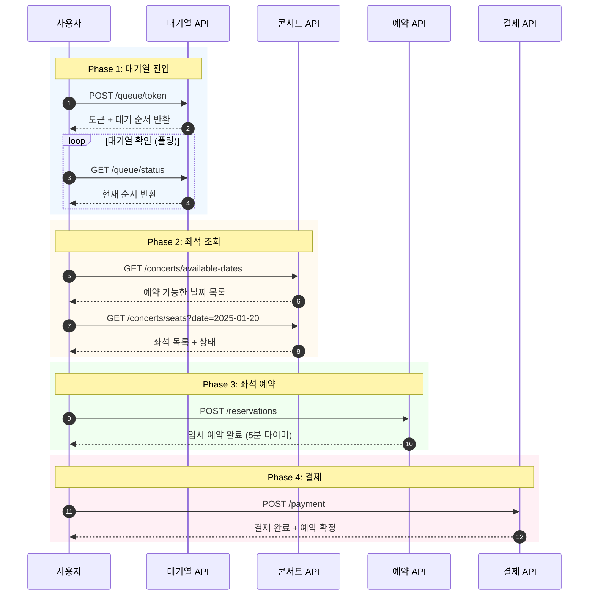
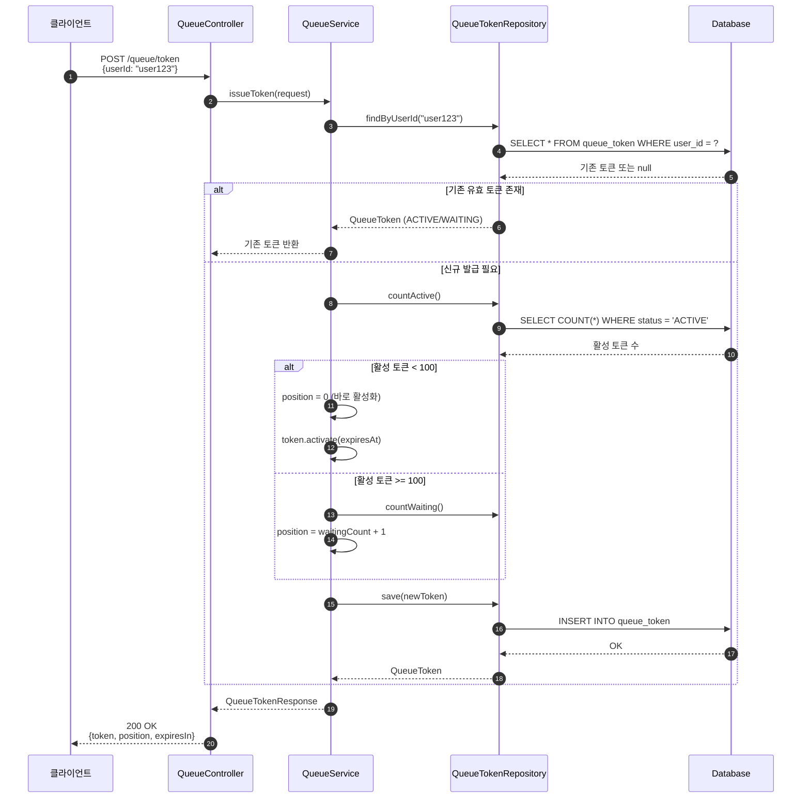
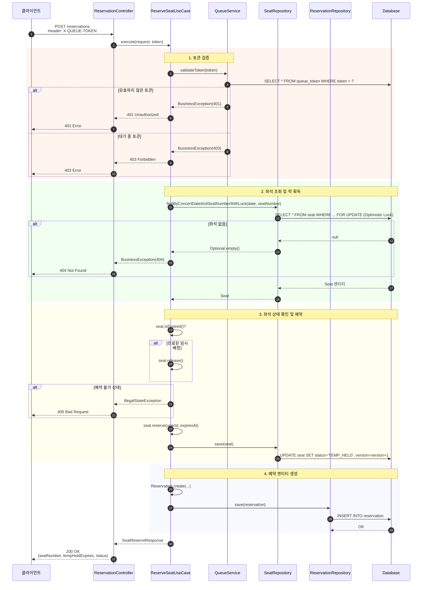
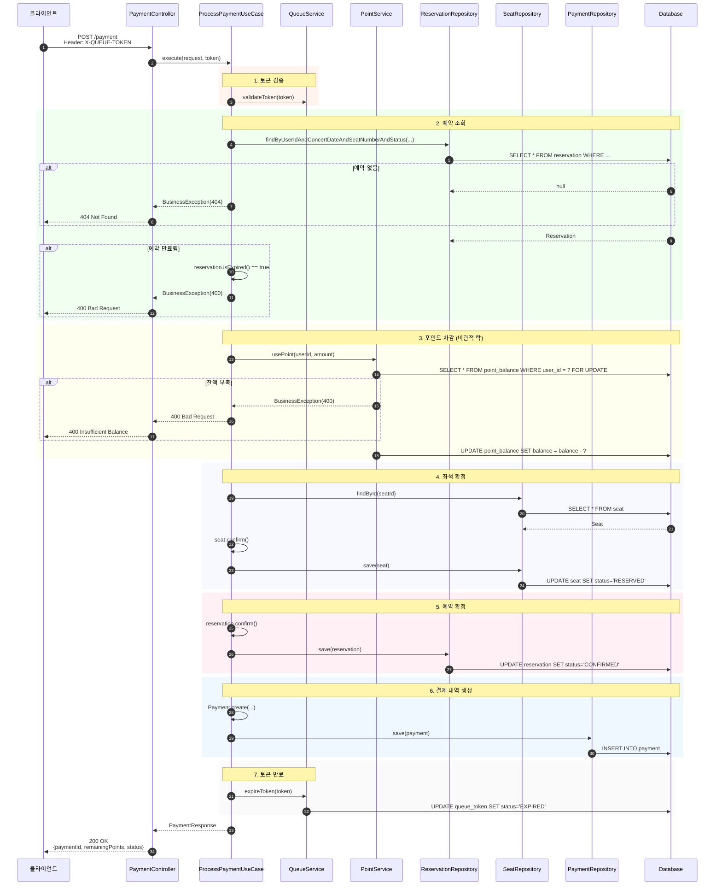
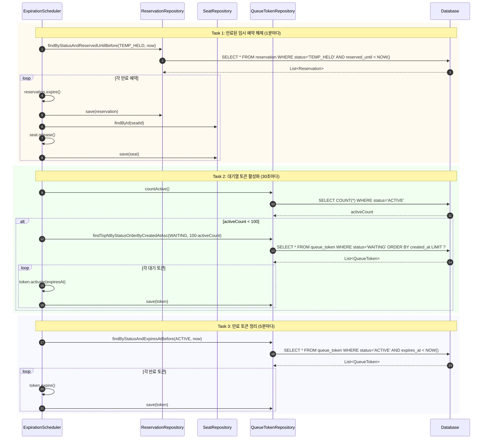
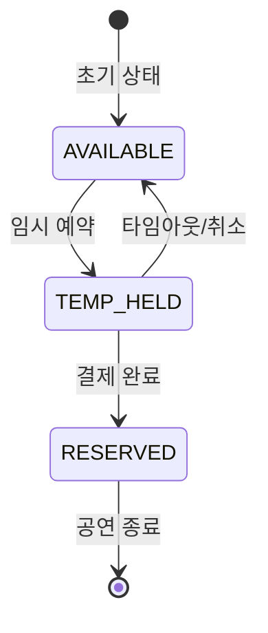
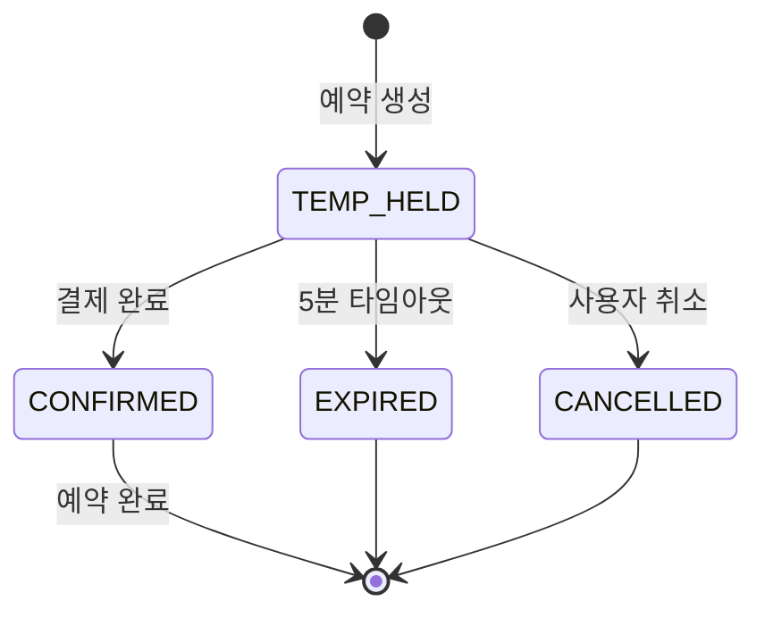
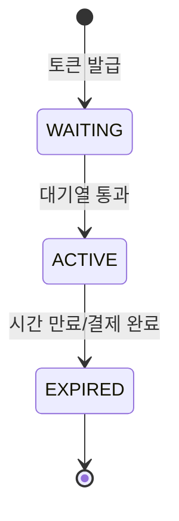

# 콘서트 예약 서비스 - 시퀀스 다이어그램

## 📋 목차
1. [전체 예약 플로우](#1-전체-예약-플로우)
2. [대기열 토큰 발급](#2-대기열-토큰-발급)
3. [좌석 예약](#3-좌석-예약-임시-배정)
4. [결제 처리](#4-결제-처리)
5. [만료 처리 스케줄러](#5-만료-처리-스케줄러)

---

## 1. 전체 예약 플로우

---

## 2. 대기열 토큰 발급

---

## 3. 좌석 예약 (임시 배정)

---

## 4. 결제 처리

---

## 5. 만료 처리 스케줄러

---

## 📊 상태 전이 다이어그램

### 좌석 상태 (SeatStatus)

### 예약 상태 (ReservationStatus)

### 토큰 상태 (TokenStatus)

