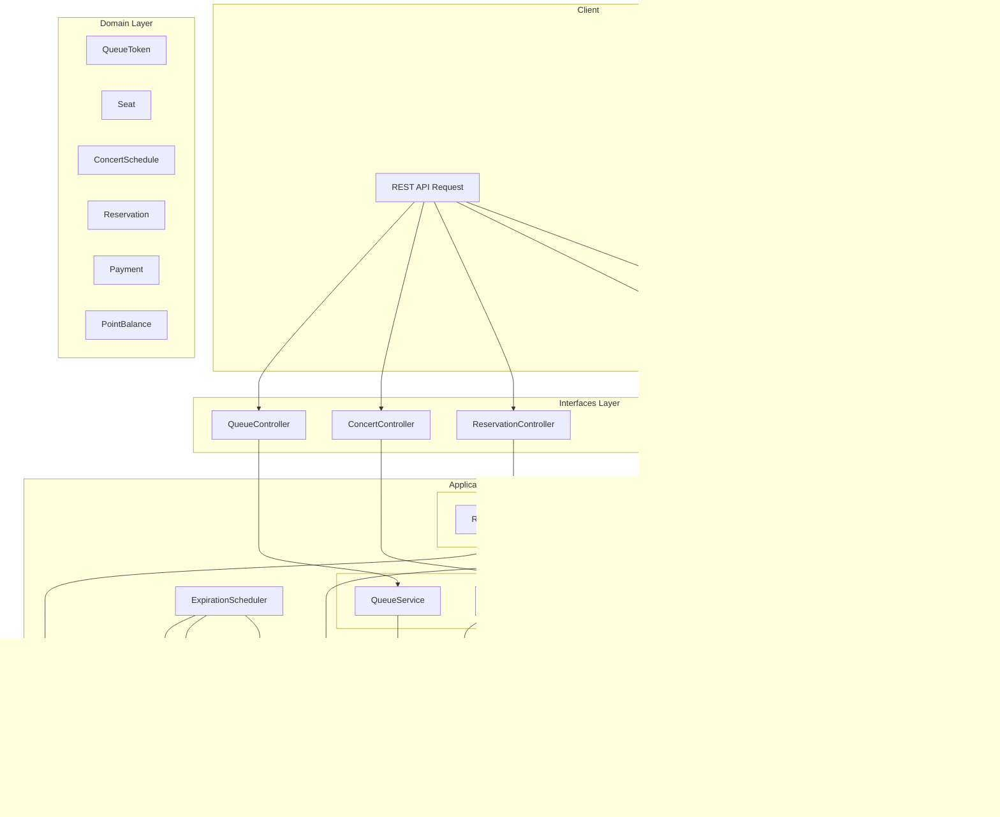

# Architecture Flowchart Preview

```mermaid
flowchart TB
    subgraph Client["Client"]
        API["REST API Request"]
    end

    subgraph Interfaces["Interfaces Layer"]
        QueueAPI["QueueController"]
        ConcertAPI["ConcertController"]
        ReservationAPI["ReservationController"]
        PaymentAPI["PaymentController"]
        PointAPI["PointController"]
    end

    subgraph Application["Application Layer"]
        subgraph Layered["Layered Architecture"]
            QueueService["QueueService"]
            ConcertService["ConcertService"]
            PointService["PointService"]
        end
        
        subgraph Clean["Clean Architecture"]
            ReserveUseCase["ReserveSeatUseCase"]
            PaymentUseCase["ProcessPaymentUseCase"]
        end
        
        Scheduler["ExpirationScheduler"]
    end

    subgraph Domain["Domain Layer"]
        QueueToken["QueueToken"]
        Seat["Seat"]
        ConcertSchedule["ConcertSchedule"]
        Reservation["Reservation"]
        Payment["Payment"]
        PointBalance["PointBalance"]
    end

    subgraph Infrastructure["Infrastructure Layer"]
        QueueRepo[("QueueTokenRepository")]
        SeatRepo[("SeatRepository")]
        ScheduleRepo[("ConcertScheduleRepository")]
        ReservationRepo[("ReservationRepository")]
        PaymentRepo[("PaymentRepository")]
        PointRepo[("PointBalanceRepository")]
        MySQL[("MySQL 8.0")]
    end

    API --> QueueAPI
    API --> ConcertAPI
    API --> ReservationAPI
    API --> PaymentAPI
    API --> PointAPI

    QueueAPI --> QueueService
    ConcertAPI --> ConcertService
    ReservationAPI --> ReserveUseCase
    PaymentAPI --> PaymentUseCase
    PointAPI --> PointService

    QueueService --> QueueRepo
    ConcertService --> SeatRepo
    ConcertService --> ScheduleRepo
    ReserveUseCase --> SeatRepo
    ReserveUseCase --> ReservationRepo
    PaymentUseCase --> ReservationRepo
    PaymentUseCase --> PaymentRepo
    PaymentUseCase --> PointService
    PointService --> PointRepo
    Scheduler --> ReservationRepo
    Scheduler --> SeatRepo
    Scheduler --> QueueRepo

    QueueRepo --> MySQL
    SeatRepo --> MySQL
    ScheduleRepo --> MySQL
    ReservationRepo --> MySQL
    PaymentRepo --> MySQL
    PointRepo --> MySQL
```
